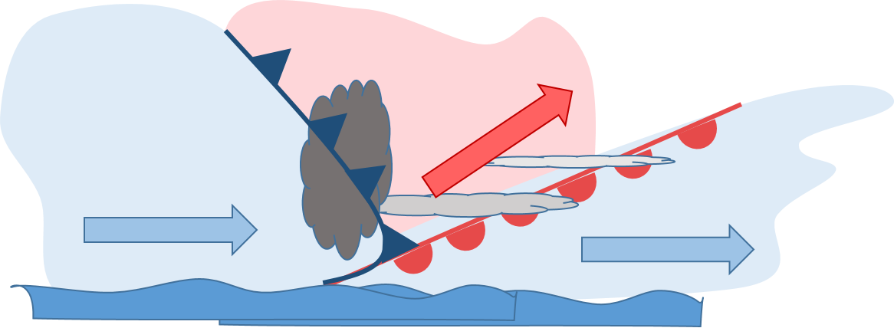

# Définissez un front occlus
  Un schema en coupe (vu de coté) est attendu, rendant compte du déplacement des masses d'air. Plusieurs configurations sont possibles, décrivez celle de votre choix. 

# Correction

Les masses d'air n’ont pas toutes les mêmes propriétés : on peut distinguer les masses d’air chaud et d’air froid. Ces masses d’air ne se mélangent pas mais se confrontent. L’interface entre ces masses d’air est appelée front.
 Il existe plusieurs types de front :
Front chaud: Si la masse d’air froid est suivie d’une masse d’air chaud, on a un front chaud.
Front froid: Si la masse d’air chaud est suivie d’une masse d’air froid, on a un front froid.  
Front Occlus: Lorsque le front froid rattrape le front chaud, il y a une occlusion.  L’air chaud est “coincé” entre les deux fronts et est soulevé en altitude. La perturbation meurt progressivement.

<small>Source : [*Cours théorique planche à voile*, Les Glénans CEB, 2023](https://encadrementbenevole.glenans.asso.fr/wp-content/uploads/2023/07/Cours-theorique-PAV-Version-1.pdf) </small>