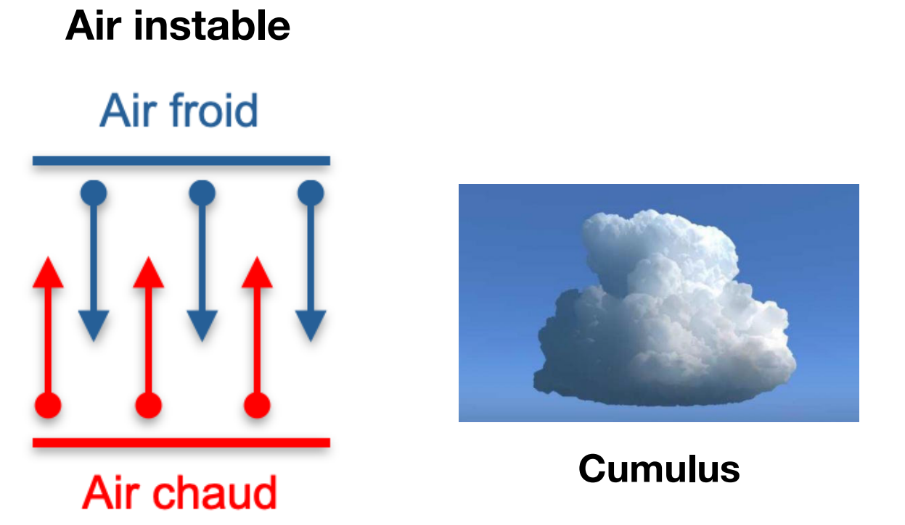

# Qu'entend-on lorsqu'on parle de masses d'air instables? Quelles concéquences d'un point de vue météo?
Un petit schéma est attendu.

# Correction
Si deux masses d’air se rencontrent et qu’elles ont des caractéristiques différentes, elles auront du mal à se mélanger. Si la masse d'air chaud est au dessous de la masse froide, alors les deux masses d'air vont se confronter, elles sont instables. L'air chaud va essayer de monter et l'air froid de descendre. Sans réellement se mélanger des turbulences et des frottements font apparaitre, créant des nuages à élévation verticale.

<small>Source : [*Cours théorique planche à voile*, Les Glénans CEB, 2023](https://encadrementbenevole.glenans.asso.fr/wp-content/uploads/2023/07/Cours-theorique-PAV-Version-1.pdf) </small>