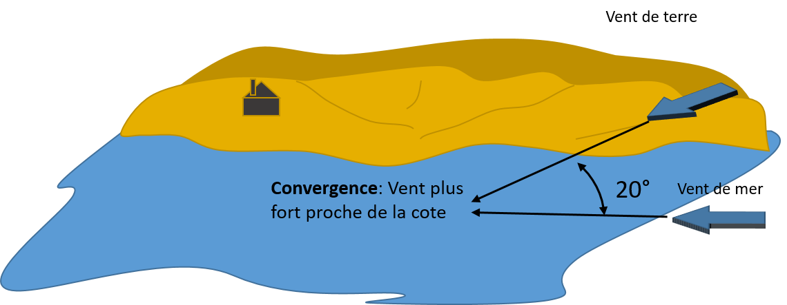

# Qu'appelle-t-on "effet de convergence" ou de divergence, observable le long des cotes peu élevées?
Comment s'explique-t-il, comment se concrétise-t-il, quelles conditions sont les plus favorables?

# Correction

Le vent n’a pas la même orientation sur l’eau que sur terre. Il est dévié de 20° vers les basses pressions sur mer, 40° sur terre (le vent prend plus de gauche sur terre). Ce phénomène est à l’origine des effets de convergence et de divergence le long des côtes. 

Si la côte est à droite du vent (dans le sens du vent) : Le frottement à la côte provoque une rotation de 20° à gauche et donc une convergence des flux à la côte avec un renforcement du vent sur une bande de 1 à 3 milles.

Inversement si la cote est à gauche du vent il y a divergence du flux à la côte. 

<small>Source : [*Cours théorique planche à voile*, Les Glénans CEB, 2023](https://encadrementbenevole.glenans.asso.fr/wp-content/uploads/2023/07/Cours-theorique-PAV-Version-1.pdf) </small>