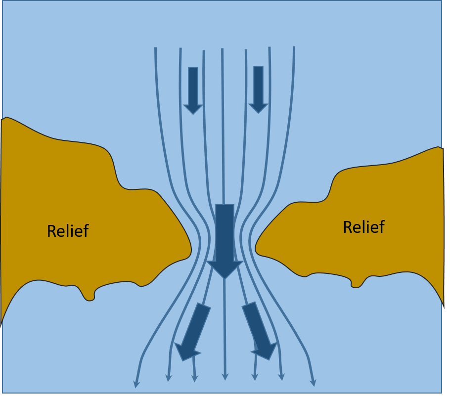

# Decrivez en quelques mots et par un schema l'effet Venturi

# Correction
Entre deux obstacles on observe une accélération du flux, appelé effet Venturi. Il s’agit d’un cas particulier de l’effet de canalisation
L'accélération commence avant le détroit et continue quelques milles après. Ex: Gibraltar, Pas de Calais, bouches de Bonifacio, passage entre deux Îles.

<small>Source : [*Cours théorique planche à voile*, Les Glénans CEB, 2023](https://encadrementbenevole.glenans.asso.fr/wp-content/uploads/2023/07/Cours-theorique-PAV-Version-1.pdf) </small>