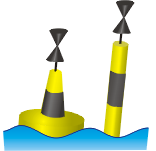

# En remontant vers le port, vous croisez la balise suivante

<small>Source Wikipedia, licence CC-BY-SA 3.0</small>

**Que signifie-t-elle ?**

# Correction
C'est une cardinale ouest, elle est située à l'ouest du danger. Il faut donc passer à l'ouest de la cardinale pour parer le danger.
